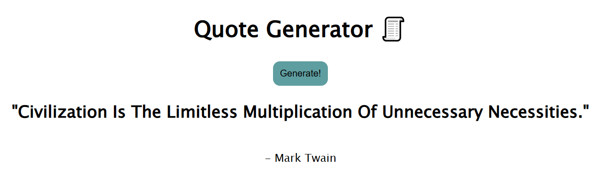

# Random Quote Generator ✨

A simple web app that shows a new random quote every time you click a button. It fetches quotes from an API and displays both the text and the author.

---

## 🚀 Features

- Fetches a random quote using an API
- Displays quote text and author
- Button-based interaction
- Built with vanilla **HTML, CSS, and JavaScript**

## Preview

---

## ✅ How to Use

1. Open the project folder
2. Run `index.html` in your browser
3. Click the **Generate Quote** button
4. New quote pops up instantly!

## OR

## [Live Link](https://faiyaz-xyz.github.io/quote-generator-api/)

---

## 🛠 Tech Stack

- HTML
- CSS
- JavaScript
- DummyJSON Quotes API

---

## 📌 Possible Future Upgrades

- Add loading animation
- Copy-to-clipboard button
- “Tweet this” or social share
- Save favorite quotes

---

Made by **Faiyaz** 😎
